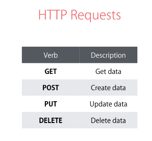
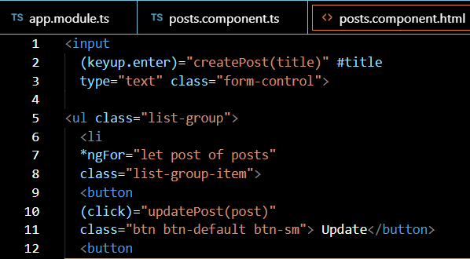

**Tugas Perorangan**

**PRAKTIKUM DESAIN & PEMROGRAMAN WEB LANJUT**

**“HTTP-Services”**

**Jobsheet 10**

**Oleh :**

**Angga Maulana Athaariq (08)**

**TI-2B / 1741720138**

**PROGRAM STUDI D-IV TEKNIK INFORMATIKA**  
**JURUSAN TEKNOLOGI INFORMASI**

**POLITEKNIK NEGERI MALANG**

**2019**

**Praktikum – Bagian 1: JSONPlaceHolder**

Pada bagian ini kita akan menggunakan fake HTTP Service yang akan kita gunakan
sebagai back end aplikasi kita. Kunjungi alamat berikut :
<http://jsonplaceholder.typicode.com/>

Jika Anda scroll down maka Anda akan menemukan bagian Resources seperti pada
gambar 2 berikut :

Gambar 2. Tampilan fake HTTP Service pada jsonplaceholder

Ini adalah fake HTTP Service, sehingga ketika kita menambahkan sebuah data baru,
maka akan ditampilkan sesuai dengan data yang kita masukkan, tetapi jika kita
mereload halamannya, maka data yang baru kita tambahkan akan hilang karena tidak
ada database di belakang HTTP Service ini.

**Praktikum - Bagian 2 : Getting Data**

| **Langkah** | **Keterangan**                                                                                                                                                                                                                       |
|-------------|--------------------------------------------------------------------------------------------------------------------------------------------------------------------------------------------------------------------------------------|
| 1           | Buat component baru dengan nama posts dengan perintah **ng g c posts**                                                                                                                                                               |
| 2           | Untuk menggunakan HTTPService, kita perlu melakukan import HttpModule pada app.module.ts.                                                                                                                                            |
| 3           | Modifikasi file **posts.component.ts** menjadi seperti berikut:                                                                                                                                                                      |
| 4           | Ubah file app.component.html seperti berikut :                                                                                                                                                                                       |
| 5           | Jalankan dan Catat hasilnya (soal 1)                                                                                                                                                                                                 |
| 6           | Bagaimana jika anda lupa melakukan import HttpModule pada langkah ke-2 ? Lakukan commenting pada HttpModule seperti pada kode berikut :                                                                                              |
| 7           | Apa yang terjadi pada console? Berikan penjelasan atas error yang terjadi. (soal 2)                                                                                                                                                  |
| 8           | Lengkapi kode program pada **posts.component.ts** menjadi :                                                                                                                                                                          |
| 9           | Jalankan pada browser dan jelaskan yang muncul pada console. (soal 3)                                                                                                                                                                |
| 10          | Jelaskan perbedaan yang terjadi pada console jika kode pada **posts.component.ts** diubah menjadi : (soal 4)                                                                                                                         |
| 11          | Untuk menampilkan data pada halaman browser, ubah kode program pada **posts.component.html** seperti berikut : \<ul class="list-group"\> \<li \*ngFor="let post of posts" class="list-group-item"\> {{ post.title }} \</li\> \</ul\> |
| 12          | Ubah kode program pada **posts.component.ts :**                                                                                                                                                                                      |
| 13          | Jalankan dan jelaskan apa yang muncul pada browser. (soal 5)                                                                                                                                                                         |

Setelah kita menambahkan HttpModule pada bagian imports, maka secara otomatis
akan menambah imports pada bagian paling atas

Hint :

Jika HttpModule tidak muncul secara otomatis maka anda harus menginstal terlebih
dahulu dengan perintah **npm i \@angular/http**

Setelah \@angular/http terinstall, maka anda dapat menjalankan praktikum pada
langkah 2.

Class Http pada contructor digunakan untuk melakukan HTTP request ke back end.

Simpan dan jalankan kembali browser.

Hasil Runningnya merupakan dari posts JSONplaceholder, Karena kita memasukkan
link dari JSONplaceholder/posts sehinggan yang keluar adalah hasil dari
placeholder posts

**Praktikum - Bagian 3 : Creating Data**

Perintah-perintah yang digunakan untuk melakukan HTTP Request diwakili oleh
beberapa kata kerja sebagai berikut digambarkan pada gambar 3.

Gambar 3. HTTP Request

| **Langkah** | **Keterangan**                                                                                                 |
|-------------|----------------------------------------------------------------------------------------------------------------|
| 1           | Kita akan menambahkan sebuah text area untuk memasukkan data melalui browser, seperti gambar berikut :         |
| 2           | Pertama, tambahkan input elemen pada **posts.component.html** :                                                |
| 3           | Modifikasi kode program pada **posts.component.ts**                                                            |
| 4           | Simpan dan jalankan pada browser.                                                                              |
| 5           | Jelaskan dengan kalimatmu sendiri bagaimana jalannya program setiap baris pada fungsi **createPost**. (soal 6) |

**Praktikum - Bagian 4 : Updating Data**

| **Langkah** | **Keterangan**                                                                                           |
|-------------|----------------------------------------------------------------------------------------------------------|
| 1           | Kita akan menambahkan sebuah button Update untuk mengubah data melalui browser, seperti gambar berikut : |
| 2           | Tambahkan button Update dengan modifikasi kode program seperti di bawah ini :                            |
| 3           | Tambahkan fungsi updatePost pada posts.ts seperti di bawah :                                             |
| 4           | Simpan dan jalankan pada browser.                                                                        |
| 5           | Apa fungsi patch pada potongan kode program pada langkah 3? (soal 7)                                     |

**Praktikum - Bagian 5 : Deleting Data**

| **Langkah** | **Keterangan**                                                                                                                     |
|-------------|------------------------------------------------------------------------------------------------------------------------------------|
| 1           | Kita akan menambahkan sebuah button Delete di sebelah button Update untuk menghapus data melalui browser, seperti gambar berikut : |
| 2           | Tambahkan button Delete dengan modifikasi kode program seperti di bawah ini :                                                      |
| 3           | Tambahkan fungsi deletePost pada posts.ts seperti di bawah :                                                                       |
| 4           | Simpan dan jalankan pada browser.                                                                                                  |
| 5           | Apa fungsi splice pada potongan kode program pada langkah 3? (soal 8)                                                              |

