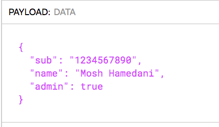

**Tugas Perorangan**

**PRAKTIKUM DESAIN & PEMROGRAMAN WEB LANJUT**

**“Authentication and Authorization”**

**Jobsheet 12**

**Oleh :**

**Angga Maulana Athaariq (08)**

**TI-2B / 1741720138**

**PROGRAM STUDI D-IV TEKNIK INFORMATIKA**  
**JURUSAN TEKNOLOGI INFORMASI**

**POLITEKNIK NEGERI MALANG**

**2019**

  
**Praktikum – Bagian 1: Implementation Login**

| **Langkah** | **Keterangan**                                                                                                                                                                                                         |
|-------------|------------------------------------------------------------------------------------------------------------------------------------------------------------------------------------------------------------------------|
| 1           | Buka folder auth-demo-starter kemudian open terminal dan lakukan ng serve. Catat hasil nya (soal 1)                                                                                                                    |
| 2           | Apabila terjadi error seperti dibawah ini :                                                                                                                                                                            |
| 3           | [./media/image5.png](./media/image5.png)                                                                                                                                                                               |
| 4           | Buka file auth.service.ts lalu tambahkan perintah seperti berikut ini :                                                                                                                                                |
| 5           | Jika sudah ditambahkan, jalankan perintah ng serve, dan klik bagian login lalu masukkan email address : <mosh@domai.com> dan password 1234 kemudian klik sign in. perhatikan apa yang terjadi? Catat hasilnya (soal 3) |
| 6           | Kemudian lakukan login dengan email yang formatnya tidak valid contoh email kita isi 1234 dengan password 1234 maka ketika kita login dan kita inspect response apa yang muncul ? Catat hasilnya (soal 4)              |
| 7           | Buka file auth.service.ts kemudian lakukan perubahan seperti berikut :                                                                                                                                                 |
| 7           | Kemudian jalankan dan lakukan login dengan username dan password yang sesuai pada no 5, kemudian lakukan inspect pilih menu application liat di local storage, apa yang terlihat ? catat hasilnya (soal 5)             |

Maka lakukan perintah untuk menginstall angular2-jwt, dengan perintah :

**npm install angular2-jwt –save** kemudian lakukan **ng serve –open**

catat hasilnya (soal 2)

**Praktikum – Bagian 2: Implemetasi Logout**

| **Langkah** | **Keterangan**                                                                                                                                                                                                                                                  |
|-------------|-----------------------------------------------------------------------------------------------------------------------------------------------------------------------------------------------------------------------------------------------------------------|
| 1           | Open file home.component.html, tambahkan                                                                                                                                                                                                                        |
| 2           | Open file auth.service.ts lalu tambahkan pada bagian logout :                                                                                                                                                                                                   |
| 3           | Jalankan aplikasi, lalukan login dengan username dan password seperti sebelumnya dan lakukan inspect, cek pada local storage harusnya token nya sudah ada di local storage. Kemudian lakukan logout. Apa yang terjadi pada local storage ? Catat hasil (soal 6) |

  
**Praktikum - Bagian 3 : Getting the Current User**

| **Langkah** | **Keterangan**                                                                                                                                                                                                     |
|-------------|--------------------------------------------------------------------------------------------------------------------------------------------------------------------------------------------------------------------|
| 1           | Buka https://jwt.io, kita akan membuat token yang nantinya akan kita tempelkan di fake-backed.ts                                                                                                                   |
| 2           | Open auth.service.ts, lakukan modifikasi pada part isLoggeedIn() sehingga menjadi seperti berikut :                                                                                                                |
| 3           | Kemudian tambahkan code berikut tepat dibawah langkah no 2 : get **currentUser**(){ let token = localStorage.**getItem**('token'); if (!token) return null; return new **JwtHelper**().**decodeToken**(token); } } |
| 4           | Open fake-backend.ts, ganti token yang lama menjadi token pada no 1                                                                                                                                                |
| 5           | Open file home.component.html , modifikasi seperti berikut :                                                                                                                                                       |
| 6           | Jalankan aplikasi. Cek apa yang terjadi dan beri penjelasan (soal 7)                                                                                                                                               |

lalu copy code hasil diatas.

