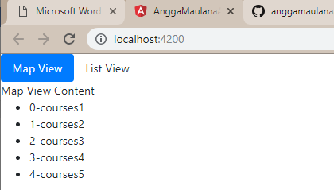
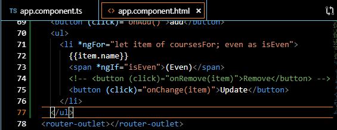
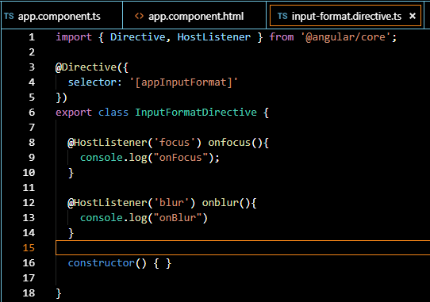
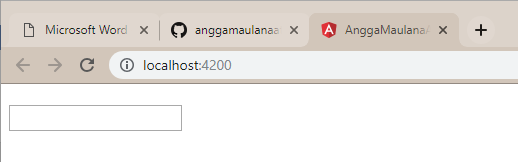

**Tugas Perorangan**

**PRAKTIKUM DESAIN & PEMROGRAMAN WEB LANJUT**

**(**Directive**)**

**Praktikum 7/ (BAB 5)**

**Oleh :**

**Angga Maulana Athaariq (08)**

**TI-2B / 1741720138**

**PROGRAM STUDI D-IV TEKNIK INFORMATIKA**  
**JURUSAN TEKNOLOGI INFORMASI**

**POLITEKNIK NEGERI MALANG**

**2019**

6.1 ngIf
--------

>   Directive ngIf digunakan untuk sebuah kondisi percabangan. Ada beberapa
>   contoh penggunaan ngIf. Contoh Pertama

-   buka file

-   buka file

-   jalankan localhost maka hasilnya seperti berikut

-   Jika array pada app.component.ts (courses=[];) dikosongkan maka hasilnya
    seperti berikut

contoh kedua menggunakan else:

-   buka file app.component.html modifikasi kodenya menjadi berikut

-   jalankan localhost dengan kondisi array pada app.component

1.  dengan array kosong

1.  dengan array ada isi

cara ketiga :

-   buka file app.component.html modifikasi kodenya menjadi berikut

-   jalankan localhost dengan kondisi array pada app.component

1.  dengan array kosong

1.  dengan array ada isi

6.1 Hidden Property
-------------------

-   buka app.component.html

    

-   jalankan localhost maka hasilnya seperti berikut

    

-   selain contoh diatas kita juga dapat memberikan property seperti berikut

>   dengan catatan pada app.component.ts pada courses terdapat array courses
>   dengan nilai 1 dan 2

-   jalankan localhost (berbeda hasil jika pada array courses tidak terdapat
    isinya)

>   Jika kita inspect element maka akan terlihat property hidden tidak terdapat
>   kondisi true ataupun false.

>   berbeda jika kita menggunakan ngIF terdapat bindings dengan nilai false

6.1 ngSwitchCase
----------------

-   buka file app.component.html modifikasi codenya menjadi seperti beriku**t**

-   buka file app.component.ts tambahkan property viewMode (line 12)

6.1 ngFor
---------

-   buka app.component.ts property CoursesFor yang berisikan array (line 12)

    

-   buka file app.component.html tambahkan directive ngFor pada element li

-   jika dijalankan maka hasilnya seperti berikut

-   kita juga dapat memberi tanda tertentu pada index yang bernilai ganjil
    dengan menggunakan isEven <https://angular.io/api/common/NgForOf>

6.1 ngFor dan change Detection
------------------------------

-   Pada percobaan ini kita akan menambahkan sebuah data array pada coursesFor

-   tambahkan button pada app.component.html (line 64)

-   tambahkan method onAdd()

-   sehingga hasilnya seperti berikut (jika kita tekan button add maka akan
    ditambahkan sebuah data courses 6)

-   setelah kita berhasil menambahkan sebuah data array pada courseFor maka
    untuk selanjutnya kita akan mencoba untuk melakukan penghapusan data. –

-   Tambahkan sebuah method onRemove pada app.component.ts

-   line 26 sebuah method dengan parameter item. Jika kita console.log (item)
    maka hasilnya pada saat kita hapus salah satu data maka hasilnya akan
    seperti berikut

-   line 27 sebuah variabel baru dengan nama index bertipe data number. Untuk
    lebih jelasnya kita bisa tambahkan console.log(index) pada method onRemove
    dan hasilnya pada saat kita hapus salah satu data maka akan seperti berikut

-   Buka app.component.html dan tambahkan sebuah button untuk menghapus (line69)

-   line 69 adalah sebuah button dimana terdapat event click yang memanggil
    method onRemove dengan parameter item

-   hasilnya seperti berikut (pada saat button remove diclick maka salah satu
    data akan hilang sementara)

-   selain itu kita juga dapat melakukan perubahan status menggunakan event
    click

-   buka file app.component.html tambahkan button (line 70)

-   pada line 70 terdapat sebuah button dan event click dimana event click ini
    memanggil method onChange dengan parameter item

-   buka file app.component.ts buatlah sebuah method onChange dengan parameter
    item dan didalam method tersebut adanya perubahan string menjadi updated

-   Hasilnya

6.1 ngFor dan trackby
---------------------

-   Buka file app.component.ts buatlah sebuah method dengan nama loadCourses
    (line 38) tapi sebelumnya buat sebuah property dengan nama coursesForOne
    (line 37)

    

-   buka file app.component.html dan tambahkan code seperti pada gambar

    

-   hasilnya saat button diclick

    

-   sekarang kita lakukan analisa buka inspect element, saat button belum
    diclick seperti pada gambar berikut

    

-   dan saat button diklik maka element ul akan muncul seperti pada gambar
    berikut

-   jika kita lakukan klik kembali maka button akan merespon kembali dengan
    menampilkan data yang sudah ada dalam arti mengunduh ulang yang sudah ada
    (jika kita lakukan klik kembali maka pada inspect element akan muncul
    highlight warna ungu dimasing-masing element li)

-   oleh karena itu kita membutuhkan TrackBy yang nanti digunakan untuk mengecek
    jika data sudah ada maka button tidak perlu melakukan actionnya kembali

-   untuk menambahkan TrackBy dengan cara menambahkan pada app.component.html
    pada directive ngFor

-   selain itu tambahkan juga sebuah method trackCourse dengan parameter index
    dan itemone pada app.component.ts

-   line 48 sebuah nilai kembalian jika itemone bernilai true maka itemone.id
    akan ditampilkan dan jika itemone bernilai false maka itemone tidak
    terdefinisi

-   jika berhasil maka pada saat button tampilkan data diklik untuk kedua
    kalinya pada inspect element tidak ada muncul highlight ungu pada
    masing-masing element li

6.1 The leading Asterik
-----------------------

>   leading asterik adalah tanda asterisk yang ada pada directive seperti
>   \*ngFor dsb. adapun maksud leading asterisk pada sebuah directive adalah
>   bahwa kita memberi tahu angular untuk menulis ulang markup tertentu, seperti
>   code berikut

>   pada gambar diatas terdapat sebuah directive \*ngIF dimana fungsi dari
>   asterisk pada ngIf adalah memberi tahu angular untuk menulis ulang markup
>   dari div tersebut menggunakan ng template dengan menggunakan property
>   binding seperti pada gambar berikut

6.1 ngClass
-----------

>   jika pada percobaan sebelumnya kita membuat component favorite menggunakan 2
>   class binding yaitu class binding fa-star dan fa-star-o seperti pada gambar
>   berikut

>   selain menggunakan class binding seperti diatas kita juga dapat menggunakan
>   attribute directive class seperti berikut

6.1 Custom Directive
--------------------

-   pertama kita harus membuat directive dengan nama input-format terlebih
    dahulu dengan perintah seperti berikut:

    

-   jika directive berhasil digenerate maka kita pastikan di app.module.ts pada
    \@NgModule terdapat nama directive yang kita buat tadi

    

-   buka input-format.directive.ts dan tambahkan decorator HostListener seperti
    pada gambar berikut

    

-   Buka file app.component.html dan tambahakn code berikut

    

-   line 89 terdapat appInputFormat adalah selector pada
    inputformat.directive.ts

    

-   Kita jalan localhost:4200 setelah itu lakukan percobaan click pada textbox
    dan click diluar textbox. Amati dengan menggunakan console inspect element.
    Pada saat kita click pada textbox maka pada console akan muncul onFocus
    tetapi jika click diluar textbox maka console akan keluat onBlur

    

-   Setelah kita memahami fungsi dari decorator \@HostListener maka untuk
    berikutnya kita akan mencoba membuat logika untuk merubah value dari textbox
    menjadi lowercase

-   buka file input-format.directive.ts dan modifikasi codenya menjadi berikut

    

-   Jalankan localhost dan berikan masukan dengan huruf besar semua setelah itu
    tekan tab, jika berhasil maka valuenya akan berubah menjadi huruf kecil
    semua

    

    

    Setelah ditekan TAB

-   atau kita bisa menggunakan cara lain dengan menggunakan property binding

-   buka file app.component.html dan tambahkan property binding dengan nama
    format

    

-   buka file input-format.directive.ts tambahkan decorator input dan modifikasi
    codenya seperti pada gambar berikut

    

-   line 7 adalah sebuah decorator input dengan nama property format

-   line 14 – 16 adalah sebuah kondisi dimana jika format sama dengan lowercase
    maka semua inputan akan dibuat menjadi huruf kecil semua sedangkan jika
    selain lowercase maka akan dibuat huruf besar

-   cat:format disini adalah kondisi di app.component.html

    

-   atau kita juga dapat menggunakan cara lain yaitu menggunakan nama selector
    sebagai property binding

-   buka app.component.hml modifikasi codenya menjadi berikut

    

-   buka input-format.directive.ts dan tambahkan decorator input dengan
    parameter appInputFormat

    

-   Jika dijalankan sebagai contoh kita memasukkan kalimat dengan huruf kecil
    dan pada saat kita tab maka akan berubah menjadi huruf besar semua seperti
    berikut

    

    

    Setelah di TAB
